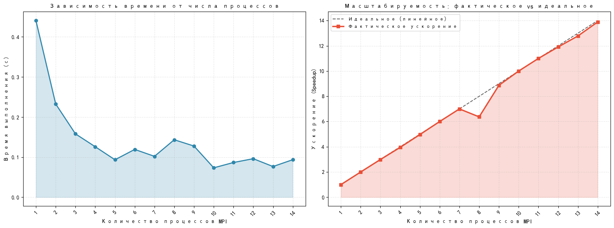

# Параллельная оценка числа π (MPI + GSL)

Учебный проект на C++, демонстрирующий ускорение вычислений при переходе от последовательного выполнения к параллельному с использованием **MPI**. Для генерации случайных чисел применяется сторонняя библиотека **GNU Scientific Library (GSL)**.

## О проекте

Программа оценивает значение числа π методом Монте-Карло:
- В единичном квадрате `[0, 1] × [0, 1]` генерируются случайные точки.
- Считается доля точек, попавших в четверть единичного круга (`x² + y² ≤ 1`).
- Приближённое значение вычисляется по формуле: `π ≈ 4 × (попадания / всего точек)`.


## Требования

- C++11+ компилятор (`g++` или `clang++`)
- CMake ≥ 3.10
- Реализация MPI (OpenMPI или MPICH)
- Библиотека [GSL](https://www.gnu.org/software/gsl/) (GNU Scientific Library)
- ОС: Linux / macOS / WSL (инструкция приведена для Ubuntu/Debian)

## Установка зависимостей

```bash
sudo apt update
sudo apt install -y build-essential cmake libopenmpi-dev openmpi-bin libgsl-dev
```

## Сборка и запуск

### Создание директории сборки
```bash
mkdir build && cd build
```

### Конфигурация проекта
```bash
cmake .. -DCMAKE_BUILD_TYPE=Release
```

### Сборка
```bash
cmake --build .
```

### Запуск
```bash
mpirun -np 4 ./pi_mpi
```

## Как измерить ускорение?

1. Запустите программу с `-np 1` и запишите значение `Время (с)`.
2. Запустите с `-np 4` (или другим количеством доступных ядер) и запишите новое время.
3. Рассчитайте ускорение по формуле:
   ```
   Speedup = Время_последовательное / Время_параллельное
   ```
Ожидается близкое к линейному ускорение (`~N`), ограниченное только накладными расходами MPI и особенностями работы планировщика ОС.

## Как это работает

| Компонент | Роль в проекте |
|-----------|----------------|
| **MPI** | Распределяет количество точек между процессами, синхронизирует старт замеров (`MPI_Barrier`), собирает результаты (`MPI_Reduce` с `MPI_SUM` и `MPI_MAX`). |
| **GSL** | Используется высококачественный ГПСЧ `gsl_rng_mt19937` (Mersenne Twister). Каждый процесс получает уникальный `seed`, что гарантирует статистически независимые потоки случайных чисел. |
| **Балансировка** | Общее число точек (`100 000 000`) делится между процессами поровну, остаток распределяется по одному на первые `N` рангов. |


## Полученные результаты


Небольшое падение эффективности при 8 процессах (79.6%) вероятно связано с особенностями планирования потоков или кэш-памяти d системе. При дальнейшем росте числа процессов эффективность восстанавливается.

Средняя эффективность параллелизации: ~96% 

```
=== Оценка числа Pi (Monte Carlo) ===
Процессов MPI:  1
Всего точек:    100000000
Оценка Pi:      3.14146
Время (с):      0.440639
====================================
```

```
=== Оценка числа Pi (Monte Carlo) ===
Процессов MPI:  2
Всего точек:    100000000
Оценка Pi:      3.14149
Время (с):      0.232648
Ускорение:      ~2x
====================================
```

```
=== Оценка числа Pi (Monte Carlo) ===
Процессов MPI:  3
Всего точек:    100000000
Оценка Pi:      3.14148
Время (с):      0.158098
Ускорение:      ~2.98878x
====================================
```

```
=== Оценка числа Pi (Monte Carlo) ===
Процессов MPI:  4
Всего точек:    100000000
Оценка Pi:      3.14134
Время (с):      0.126067
Ускорение:      ~3.95177x
====================================
```

```
=== Оценка числа Pi (Monte Carlo) ===
Процессов MPI:  5
Всего точек:    100000000
Оценка Pi:      3.14151
Время (с):      0.0935637
Ускорение:      ~4.96875x
====================================
```

```
=== Оценка числа Pi (Monte Carlo) ===
Процессов MPI:  6
Всего точек:    100000000
Оценка Pi:      3.14164
Время (с):      0.119323
Ускорение:      ~6x
====================================
```

```
=== Оценка числа Pi (Monte Carlo) ===
Процессов MPI:  7
Всего точек:    100000000
Оценка Pi:      3.14166
Время (с):      0.102067
Ускорение:      ~7x
====================================
```

```
=== Оценка числа Pi (Monte Carlo) ===
Процессов MPI:  8
Всего точек:    100000000
Оценка Pi:      3.14166
Время (с):      0.143441
Ускорение:      ~6.36922x
====================================
```

```
=== Оценка числа Pi (Monte Carlo) ===
Процессов MPI:  9
Всего точек:    100000000
Оценка Pi:      3.14172
Время (с):      0.127715
Ускорение:      ~8.87009x
====================================
```

```
=== Оценка числа Pi (Monte Carlo) ===
Процессов MPI:  10
Всего точек:    100000000
Оценка Pi:      3.14171
Время (с):      0.0734174
Ускорение:      ~10x
```

```
=== Оценка числа Pi (Monte Carlo) ===
Процессов MPI:  11
Всего точек:    100000000
Оценка Pi:      3.14168
Время (с):      0.0867111
Ускорение:      ~11x
====================================
```

```
=== Оценка числа Pi (Monte Carlo) ===
Процессов MPI:  12
Всего точек:    100000000
Оценка Pi:      3.14172
Время (с):      0.0961894
Ускорение:      ~11.909x
====================================
```

```
=== Оценка числа Pi (Monte Carlo) ===
Процессов MPI:  13
Всего точек:    100000000
Оценка Pi:      3.14166
Время (с):      0.0766747
Ускорение:      ~12.7812x
====================================
```

```
=== Оценка числа Pi (Monte Carlo) ===
Процессов MPI:  14
Всего точек:    100000000
Оценка Pi:      3.14163
Время (с):      0.0936885
Ускорение:      ~13.8901x
====================================
```